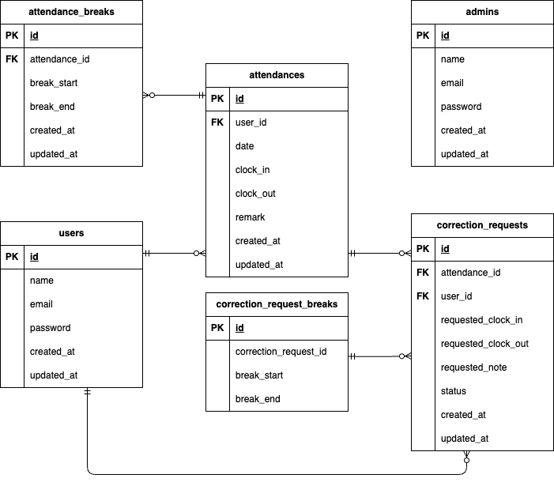

# 環境構築

**Docker環境構築**
1. `git clone https://github.com/riichikawashima-cmd/coachtech-attendance.git`
2. `cd coachtech-attendance`
3. DockerDesktopアプリを立ち上げる
4. `docker compose up -d --build`


> *MacのM1・M2チップのPCの場合、`no matching manifest for linux/arm64/v8 in the manifest list entries`のメッセージが表示されビルドができないことがあります。
エラーが発生する場合は、docker-compose.ymlファイルの「mysql」内に「platform」の項目を追加で記載してください*
``` bash
mysql:
    platform: linux/x86_64
    image: mysql:8.0.26
    environment:
```
**Laravel環境構築**
1. `docker compose exec php bash`
2. `composer install`
3. 「.env.example」ファイルを 「.env」ファイルに命名を変更。または、新しく.envファイルを作成
4. .envに以下の環境変数を追加
``` text
DB_CONNECTION=mysql
DB_HOST=mysql
DB_PORT=3306
DB_DATABASE=laravel_db
DB_USERNAME=laravel_user
DB_PASSWORD=laravel_pass

MAIL_MAILER=smtp
MAIL_HOST=mailhog
MAIL_PORT=1025
MAIL_USERNAME=null
MAIL_PASSWORD=null
MAIL_ENCRYPTION=null
MAIL_FROM_ADDRESS=no-reply@example.com
MAIL_FROM_NAME="Attendance App"
```
5. アプリケーションキーの作成
``` bash
php artisan key:generate
```

6. マイグレーションの実行
``` bash
php artisan migrate
```

7. シーディングの実行
``` bash
php artisan db:seed
```

## 使用技術（実行環境）
- PHP 8.1.34
- Laravel 10.50.0
- MySQL 8.0.44
- Docker / Docker Compose


## ER図


## URL
- アプリ：http://localhost
- phpMyAdmin：http://localhost:8080
- Mailhog（メール確認）：http://localhost:8025


## テストの実行方法
1. テスト用DB作成

ホスト側で以下を実行してください。
```bash
docker-compose exec mysql mysql -uroot -p -e "CREATE DATABASE demo_test;"
```

※ パスワードは docker-compose.yml に設定している MYSQL_ROOT_PASSWORD の値を入力してください。

作成確認：
```bash
docker-compose exec mysql mysql -uroot -p -e "SHOW DATABASES;"
```

demo_test が表示されればOKです。

2. .env.testing 作成

PHPコンテナ内で

```bash
cp .env .env.testing
```

3. .env.testing を以下の内容に修正

```env
APP_NAME=Laravel
APP_ENV=testing
APP_KEY=
APP_DEBUG=true
APP_URL=http://localhost

DB_CONNECTION=mysql_test
DB_HOST=mysql
DB_PORT=3306
DB_DATABASE=demo_test
DB_USERNAME=root
DB_PASSWORD=root

BROADCAST_DRIVER=log
CACHE_DRIVER=array
FILESYSTEM_DISK=public
QUEUE_CONNECTION=sync
SESSION_DRIVER=array
SESSION_LIFETIME=120

MAIL_MAILER=array
```
※ `APP_KEY` は空のままでOKです。（次の `key:generate` 実行で自動生成されます）

※ 本アプリでは config/database.php に mysql_test 接続を追加しています。

4. テスト用アプリケーションキー生成

```bash
php artisan key:generate --env=testing
```

5. テスト用マイグレーション実行
```bash
php artisan migrate --env=testing
```

6. テスト実行方法

PHPコンテナ内で以下を実行

```bash
php artisan test
```

特定のテストのみ実行したい場合：

```bash
php artisan test tests/Feature/AttendanceTest.php
```

### テストファイル一覧の確認方法

PHPコンテナ内で以下を実行してください。

```bash
ls tests/Feature
```

## 補足（コーチ確認事項）
※ 機能要件に詳細な記載がない場合は、本実装で問題ない旨コーチより許可をいただいています。

1. 